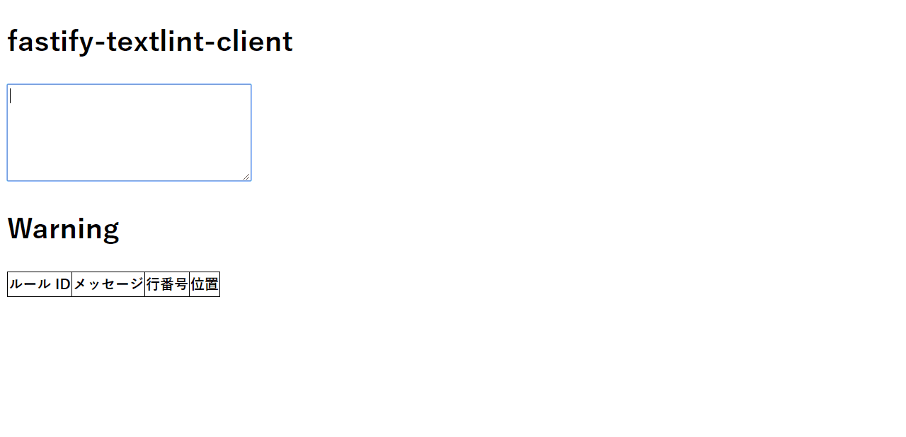

# fastify-textlint-sample



[fastify](https://github.com/fastify/fastify) を使って [textlint](https://github.com/textlint/textlint) の処理結果を返すサンプルを作ってみました。  
クライアントは差し替え可能です。サンプルとして、[Vue](https://github.com/vuejs/vue) + [Vuex](https://github.com/vuejs/vuex) を使ったものを `client` ディレクトリに配置しています。

# 手元で動かしたいとき

```bash
$ cd client
$ npm install && npm run dev

// ↑ でシェルが占有されるので別シェルで
$ cd textlint-server
$ npm install && node server
```

両方立ち上がったら、`http://localhost:8080` で動作を確認することができます。

# 有効にしているルール

+ [textlint-rule-max-ten](https://github.com/textlint-ja/textlint-rule-max-ten)
+ [textlint-rule-no-mix-dearu-desumasu](https://github.com/textlint-ja/textlint-rule-no-mix-dearu-desumasu)
